# 🚗 Smart Parking Management System (SPMS) - ASP.NET Core MVC & SQL Server

Dự án **Quản Lý Bãi Đỗ Xe Thông Minh (Smart Parking Management System - SPMS)** là ứng dụng web được xây dựng trên mô hình **ASP.NET Core Web App (Model-View-Controller)** sử dụng **.NET 8.0** và hệ quản trị cơ sở dữ liệu **Microsoft SQL Server**. 

Hệ thống hướng tới việc tự động hóa toàn bộ quy trình đỗ xe đô thị mà không cần nhân sự trực bãi thông qua hệ thống barie/khóa thông minh ở mỗi chỗ đỗ xe.

---

## 📝 Giới Thiệu Đề Tài

**SPMS** là giải pháp chuyển đổi số toàn diện kết nối giữa **Khách hàng** có nhu cầu đỗ xe và các **Chủ bãi xe**:
- **Khách hàng:** Tìm kiếm bãi xe theo cấp hành chính (Tỉnh - Huyện - Xã), đặt chỗ trước, thanh toán trực tuyến và **tự nắm quyền điều khiển mở/đóng Barie** của vị trí đỗ thông qua giao diện Web sau khi đặt chỗ thành công.
- **Chủ bãi xe:** Đăng ký bãi xe trực tuyến (yêu cầu hình ảnh, vị trí, giấy phép), thiết lập sơ đồ bãi đỗ (chia Khu vực và các Chỗ đỗ có gắn Barie), cấu hình giá vé, phản hồi Chat hỗ trợ khách hàng và theo dõi thống kê doanh thu thực nhận.
- **Quản trị viên (Admin):** Kiểm duyệt hồ sơ bãi xe (hệ thống tự động cấp tài khoản chủ bãi và gửi email thông tin đăng nhập), cấu hình tỷ lệ hoa hồng chiết khấu trên mỗi lượt đỗ xe và quản lý khiếu nại tài chính.

---

## 🛠️ Công Nghệ Sử Dụng (Tech Stack)

### 1. Backend & Hệ Thống
- **Framework chính:** **ASP.NET Core Web App (Model-View-Controller)** (.NET 8.0)
- **Cơ sở dữ liệu:** **Microsoft SQL Server**
- **ORM (Object-Relational Mapping):** **Entity Framework Core (EF Core)**
- **Xác thực & Phân quyền:** Cookie-based Authentication (`Microsoft.AspNetCore.Authentication.Cookies`) kết hợp phân quyền theo Vai trò (Claim-based Roles: Admin, Chủ bãi xe, Khách hàng).
- **Thời gian thực (Real-time):** **SignalR** phục vụ truyền tin nhắn Chat trực tuyến tức thời.
- **Dịch vụ nền (Background Worker):** `IHostedService` / `BackgroundService` tự động kiểm tra giải phóng chỗ đỗ và cập nhật trạng thái đơn đặt chỗ sang "Quá hạn" (Expired) nếu khách hàng không đến đúng giờ.
- **Thanh toán & Gửi mail:** Cổng VNPAY API, thư viện MailKit (SMTP) để tự động gửi thông báo mật khẩu cho chủ bãi.

### 2. Frontend
- **Template Engine:** Razor Pages (`.cshtml`)
- **UI Framework:** Bootstrap 5, FontAwesome 6, SweetAlert2 (thông báo đẹp mắt)
- **Javascript Libraries:** jQuery, SignalR Client, Chart.js (vẽ biểu đồ doanh thu trực quan)

---

## 👥 Phân Quyền & Tính Năng Chi Tiết (Actors & Use Cases)

```mermaid
graph TD
    A[Hệ thống Smart Parking] --> B(Khách Hàng)
    A --> C(Chủ Bãi Xe)
    A --> D(Admin Hệ Thống)

    B --> B1[Đăng ký/Đăng nhập & Quản lý xe]
    B --> B2[Tìm kiếm bãi xe theo Tỉnh/Huyện/Xã]
    B --> B3[Đặt chỗ trước & Thanh toán VNPAY]
    B --> B4[Điều khiển Barie/Khóa thông minh tại chỗ đỗ]
    B --> B5[Chat thời gian thực & Đánh giá/Khiếu nại]

    C --> C1[Đăng ký bãi đỗ & Gửi hồ sơ hình ảnh]
    C --> C2[Cấu hình Khu vực, Chỗ đỗ & Mã hóa Barie]
    C --> C3[Thiết lập bảng giá vé dịch vụ]
    C --> C4[Thống kê doanh số sau khi trừ chiết khấu]
    C --> C5[Chat trực tuyến tư vấn khách hàng]

    D --> D1[Xét duyệt đơn đăng ký & Gửi Email mật khẩu tự động]
    D --> D2[Quản lý tài khoản người dùng]
    D --> D3[Thống kê hoa hồng chiết khấu hệ thống]
    D --> D4[Admin tiếp nhận & Giải quyết khiếu nại]
```



### 1. Khách Hàng (Customer)
*   **Đăng ký/Đăng nhập:** Tạo tài khoản, đăng nhập hệ thống, cập nhật thông tin cá nhân.
*   **Quản lý xe:** Lưu danh sách biển số xe cá nhân để rút ngắn thời gian làm thủ tục đặt chỗ.
*   **Tìm kiếm & Lọc bãi xe:** Tìm kiếm bãi xe theo Tỉnh -> Huyện -> Xã. Lọc theo giá vé tốt nhất hoặc đánh giá cao nhất.
*   **Đặt chỗ & Thanh toán:** Chọn thời gian gửi dự kiến, thanh toán trực tuyến (VNPAY/MoMo) để hoàn tất giữ chỗ.
*   **Điều khiển Barie thông minh:** 
    *   Trong thời gian đơn đặt chỗ có hiệu lực, khách hàng được cấp quyền điều khiển Barie của chỗ đỗ đó.
    *   Khách hàng nhấn nút **"Mở Barie"** trên giao diện web để đỗ xe vào vị trí, và nhấn **"Khóa lại/Đóng Barie"** khi rời bãi.
*   **Giao tiếp & Phản hồi:**
    *   **Chat trực tuyến (SignalR):** Nhắn tin trực tiếp hỏi đáp kỹ thuật với chủ bãi xe.
    *   **Đơn khiếu nại:** Gửi khiếu nại đến Admin nếu gặp sự cố thanh toán lỗi hoặc chỗ đỗ bị chiếm dụng.
    *   **Đánh giá (Verified Review):** Chỉ cho phép đánh giá số sao (1-5★) và bình luận sau khi đã thực hiện giao dịch đỗ xe thành công.

### 2. Chủ Bãi Xe (Parking Owner)
*   **Đăng ký bãi xe:** Đăng tải thông tin chi tiết, hình ảnh thực tế bãi xe, số điện thoại, email liên hệ và giấy phép kinh doanh. Nhận email chứa tài khoản và mật khẩu ngẫu nhiên sau khi được Admin phê duyệt.
*   **Quản lý Sơ đồ bãi đỗ:**
    *   Chia bãi xe thành nhiều **Khu vực** (ví dụ: Khu A dành cho Ô tô, Khu B dành cho Xe máy) để dễ dàng quản lý.
    *   Tạo danh sách các **Chỗ đỗ xe** trong từng khu vực, cấu hình mã API định danh của khóa thông minh (`MaSoKhoa`) tương ứng.
*   **Quản lý Bảng giá:** Thiết lập mức phí giữ chỗ (`GiaDatCho`), giá đỗ theo giờ (`GiaTheoGio`), giá đỗ qua đêm (`GiaQuaDem`).
*   **Hỗ trợ khách hàng:** Chat trực tuyến phản hồi thắc mắc của khách hàng tại bãi xe.
*   **Báo cáo doanh số:** Biểu đồ doanh thu thực nhận (đã khấu trừ chiết khấu hoa hồng của Admin) theo ngày/tuần/tháng/năm và xuất file Excel.

### 3. Admin Hệ Thống (Administrator)
*   **Xét duyệt hồ sơ đối tác:** Kiểm duyệt hình ảnh, giấy phép bãi xe đăng ký mới. Bấm Duyệt để kích hoạt bãi xe, đồng thời hệ thống tự động gọi SMTP Server gửi email thông tin đăng nhập cho chủ bãi.
*   **Quản trị tài khoản:** Quản lý tất cả tài khoản khách hàng, chủ bãi xe; khóa các tài khoản vi phạm.
*   **Thống kê tài chính toàn hệ thống:** Thống kê tổng doanh thu thu nhập từ phí hoa hồng chiết khấu trên mỗi hóa đơn đặt chỗ của các bãi xe đối tác.
*   **Giải quyết khiếu nại:** Tiếp nhận khiếu nại từ khách hàng và làm trung gian phân xử hoàn tiền hoặc cảnh cáo chủ bãi.

---

## 📁 Cấu Trúc Mã Nguồn Dự Án

Mã nguồn được tổ chức theo cấu trúc phân lớp chuẩn của một dự án ASP.NET Core MVC, chia tách không gian phát triển theo từng **Actor (Vai trò)** để tránh tối đa việc ghi đè code lẫn nhau:

```text
CUOIKICSHARP/
│
├── WebApplication1/                     # Thư mục giải pháp (Visual Studio Solution)
│   ├── WebApplication1.sln             # File Solution quản lý dự án
│   └── WebApplication1/                 # Dự án Web chính (Presentation & Logic Layer)
│       ├── Areas/                       # CHIA THEO ACTOR (Phòng ngừa xung đột code)
│       │   ├── Admin/                   # Phân hệ dành riêng cho lập trình viên ADMIN
│       │   │   ├── Controllers/         # Các Controller của Admin (vd: ApproveParkingController)
│       │   │   ├── Models/              # ViewModels dùng riêng cho Admin
│       │   │   └── Views/               # Giao diện quản lý Admin
│       │   │
│       │   ├── Owner/                   # Phân hệ dành riêng cho lập trình viên CHỦ BÃI XE
│       │   │   ├── Controllers/         # Các Controller của Owner (vd: ParkingLotManagerController)
│       │   │   ├── Models/              # ViewModels dùng riêng cho Owner
│       │   │   └── Views/               # Giao diện quản lý của Owner
│       │   │
│       │   └── Customer/                # Phân hệ dành riêng cho lập trình viên KHÁCH HÀNG
│       │       ├── Controllers/         # Các Controller của Customer (vd: BookingController)
│       │       ├── Models/              # ViewModels dùng riêng cho Customer
│       │       └── Views/               # Giao diện đặt chỗ, lịch sử cho Customer
│       │
│       ├── Extensions/                  # Đăng ký Dependency Injection riêng biệt
│       │   ├── AdminServiceRegistration.cs
│       │   ├── OwnerServiceRegistration.cs
│       │   └── CustomerServiceRegistration.cs
│       │
│       ├── Controllers/                 # Các Controller dùng chung (AccountController, HomeController...)
│       ├── Models/                      # Model dùng chung, thực thể Database và cấu hình DB
│       │   ├── Entities/                # Lớp ánh xạ bảng cơ sở dữ liệu (TinhThanh, TaiKhoan...)
│       │   └── Configurations/          # Fluent API configs riêng cho từng bảng (Tránh sửa chung DbContext)
│       ├── Views/                       # Layout dùng chung, trang chủ, trang lỗi
│       │
│       ├── wwwroot/                     # Tài nguyên tĩnh cô lập thư mục theo Actor
│       │   ├── admin/                   # CSS, JS, hình ảnh của Admin
│       │   ├── owner/                   # CSS, JS, hình ảnh của Chủ bãi
│       │   ├── customer/                # CSS, JS, hình ảnh của Khách hàng
│       │   └── common/                  # Thư viện dùng chung (Bootstrap, jQuery, v.v.)
│       │
│       ├── Program.cs                   # File khởi chạy ứng dụng (Không cần sửa nhiều)
│       └── appsettings.json             # File cấu hình kết nối CSDL và các API
│
├── database/                            # Chứa file script tạo CSDL SQL Server [db_QuanLyBaiDoXe.sql]
├── docs/                                # Tài liệu phân tích, sơ đồ thiết kế hệ thống
└── README.md                            # Tài liệu hướng dẫn này
```

---

## 🤝 Quy Tắc Làm Việc Nhóm (Tránh Xung Đột Code)

Để đảm bảo các thành viên trong nhóm có thể phát triển song song các phân hệ **Admin, Chủ bãi xe, và Khách hàng** mà không gặp lỗi xung đột khi merge Git, nhóm cần tuân thủ nghiêm ngặt các quy tắc sau:

### 1. Cô lập không gian phát triển (Areas)
- Lập trình viên phụ trách vai trò nào **chỉ được phép** thao tác trên các thư mục, file nằm trong phân hệ `Areas/[Tên_Vai_Trò]/` tương ứng.
- **Bắt buộc:** Tất cả Controller khai báo trong thư mục `Areas/` phải được gắn thuộc tính `[Area("Tên_Vai_Trò")]` trên cùng class. Ví dụ:
  ```csharp
  namespace WebApplication1.Areas.Admin.Controllers
  {
      [Area("Admin")]
      public class ApproveParkingController : Controller
      {
          public IActionResult Index() => View();
      }
  }
  ```

### 2. Không sửa chung tệp cấu hình khởi chạy (`Program.cs`)
- Nghiêm cấm các thành viên tự ý chèn trực tiếp dòng lệnh đăng ký Dependency Injection (Services, Repositories) vào `Program.cs`.
- Mọi dịch vụ cần đăng ký phải được viết trong các lớp mở rộng cô lập tương ứng tại thư mục `Extensions/`:
  - Lập trình viên Admin viết trong `Extensions/AdminServiceRegistration.cs`
  - Lập trình viên Owner viết trong `Extensions/OwnerServiceRegistration.cs`
  - Lập trình viên Customer viết trong `Extensions/CustomerServiceRegistration.cs`
- Khi cần đăng ký một Service mới (ví dụ: `IAdminService`), Admin chỉ cần vào đúng file `AdminServiceRegistration.cs` để thêm dịch vụ của mình.

### 3. Cô lập cấu hình Database (EF Core Fluent API)
- Tránh việc sửa chung tệp `DbContext.cs` để cấu hình ràng buộc cơ sở dữ liệu (`OnModelCreating`).
- Mỗi thực thể bảng sẽ có một tệp cấu hình độc lập đặt tại `Models/Configurations/` thực thi `IEntityTypeConfiguration<T>`. Ví dụ, đối với bảng `HoaDon`:
  ```csharp
  public class HoaDonConfiguration : IEntityTypeConfiguration<HoaDon>
  {
      public void Configure(EntityTypeBuilder<HoaDon> builder)
      {
          builder.HasKey(h => h.ID);
          builder.Property(h => h.TongTien).HasPrecision(18, 2);
          // Ràng buộc check constraint ...
      }
  }
  ```
- Trong `DbContext.cs`, chỉ cần khai báo một dòng lệnh quét tự động để tránh xung đột:
  ```csharp
  protected override void OnModelCreating(ModelBuilder modelBuilder)
  {
      base.OnModelCreating(modelBuilder);
      modelBuilder.ApplyConfigurationsFromAssembly(typeof(MyDbContext).Assembly);
  }
  ```

### 4. Cô lập tài nguyên tĩnh (Static Assets in wwwroot)
- Không viết code JS hoặc CSS tùy chỉnh vào tệp dùng chung `site.js` hoặc `site.css`.
- Các tệp bổ trợ giao diện riêng biệt cho từng vai trò phải đặt tại các thư mục tương ứng:
  - `wwwroot/admin/` cho phân hệ Admin.
  - `wwwroot/owner/` cho phân hệ Chủ bãi.
  - `wwwroot/customer/` cho phân hệ Khách hàng.

### 5. Quy trình Git và Tạo Nhánh (Git Workflow)
- **Đặt tên nhánh:** Tạo nhánh tính năng riêng cho từng người:
  - Nhóm Admin: `feature/admin-[tên_tính_năng]`
  - Nhóm Chủ bãi: `feature/owner-[tên_tính_năng]`
  - Nhóm Khách hàng: `feature/customer-[tên_tính_năng]`
- **Merge Code:** 
  1. Trước khi làm việc: Luôn chuyển sang nhánh chính và lấy mã mới nhất (`git checkout main` và `git pull origin main`).
  2. Merge nhánh của mình vào nhánh chính thông qua Pull Request (PR) trên GitHub. Yêu cầu có ít nhất 1 thành viên khác review và phê duyệt trước khi merge.
  3. Tuyệt đối không commit các file rác sinh ra khi chạy cục bộ (được cấu hình tự động bỏ qua qua `.gitignore`).

---

## ⚙️ Cấu Hình Hệ Thống & Cài Đặt

### 1. Yêu cầu hệ thống
- **Cơ sở dữ liệu:** Microsoft SQL Server 2019 trở lên (Express hoặc LocalDB).
- **Môi trường chạy:** .NET SDK 8.0.
- **Công cụ phát triển (IDE):** Visual Studio 2022.

### 2. Thiết lập cơ sở dữ liệu
Hệ thống sử dụng cơ sở dữ liệu đã chuẩn hóa cấu trúc phân cấp địa chỉ hành chính Việt Nam và cấu trúc barie thông minh.
1. Mở **SQL Server Management Studio (SSMS)**.
2. Kết nối tới SQL Server của bạn.
3. Mở file [db_QuanLyBaiDoXe.sql](file:///d:/HK225/CSHARP/CUOIKICSHARP/database/db_QuanLyBaiDoXe.sql) và nhấn **Execute (F5)** để tạo Database `QuanLyBaiXe` và nạp sẵn dữ liệu mẫu.

### 3. Cấu hình chuỗi kết nối trong `appsettings.json`
Mở file `src/SmartParking.Web/appsettings.json` và cấu hình lại chuỗi kết nối SQL Server:
```json
{
  "ConnectionStrings": {
    "DefaultConnection": "Server=YOUR_SQL_SERVER_NAME;Database=QuanLyBaiXe;Trusted_Connection=True;MultipleActiveResultSets=true;TrustServerCertificate=True"
  },
  "SmtpSettings": {
    "Server": "smtp.gmail.com",
    "Port": 587,
    "SenderName": "Smart Parking System",
    "SenderEmail": "your-email@gmail.com",
    "Password": "your-app-password"
  },
  "VnPay": {
    "TmnCode": "YOUR_VNPAY_TMNCODE",
    "HashKey": "YOUR_VNPAY_HASHKEY",
    "BaseUrl": "https://sandbox.vnpayment.vn/paymentv2/vpcpay.html"
  }
}
```

### 4. Thiết lập Dependency Injection & Routing (`Program.cs`)
Trong file `Program.cs`, dự án cấu hình kết nối SQL Server và các dịch vụ bổ trợ:
```csharp
using Microsoft.EntityFrameworkCore;
using Microsoft.AspNetCore.Authentication.Cookies;
using SmartParking.Data.Context;
using SmartParking.Web.Hubs;

var builder = WebApplication.CreateBuilder(args);

// 1. Cấu hình kết nối SQL Server qua Entity Framework Core
builder.Services.AddDbContext<SmartParkingDbContext>(options =>
    options.UseSqlServer(builder.Configuration.GetConnectionString("DefaultConnection")));

// 2. Đăng ký Cookie Authentication & Phân quyền
builder.Services.AddAuthentication(CookieAuthenticationDefaults.AuthenticationScheme)
    .AddCookie(options =>
    {
        options.LoginPath = "/Account/Login";
        options.AccessDeniedPath = "/Account/AccessDenied";
        options.ExpireTimeSpan = TimeSpan.FromDays(7);
    });

// 3. Đăng ký các Business Services (Dependency Injection)
builder.Services.AddScoped<IEmailService, EmailService>();
builder.Services.AddScoped<IBarrierService, BarrierService>();
builder.Services.AddScoped<IPaymentService, PaymentService>();

// 4. Kích hoạt SignalR cho chức năng Chat trực tuyến thời gian thực
builder.Services.AddSignalR();

builder.Services.AddControllersWithViews();

var app = builder.Build();

// Cấu hình HTTP Pipeline
if (!app.Environment.IsDevelopment())
{
    app.UseExceptionHandler("/Home/Error");
    app.UseHsts();
}

app.UseHttpsRedirection();
app.UseStaticFiles();

app.UseRouting();

app.UseAuthentication();
app.UseAuthorization();

// Cấu hình Routing cho phân hệ Areas (Admin và Owner) và Route mặc định
app.MapControllerRoute(
    name: "areas",
    pattern: "{area:exists}/{controller=Home}/{action=Index}/{id?}");

app.MapControllerRoute(
    name: "default",
    pattern: "{controller=Home}/{action=Index}/{id?}");

// Map SignalR Hub
app.MapHub<ChatHub>("/chatHub");

app.Run();
```

---

## 🚀 Cách Chạy Dự Án

### Sử dụng Visual Studio 2022:
1. Mở file solution `.sln` trong thư mục `src`.
2. Kiểm tra xem dự án **SmartParking.Web** đã được chọn làm **Startup Project** chưa (Nhấp chuột phải vào dự án -> *Set as Startup Project*).
3. Nhấn **F5** hoặc bấm vào nút **Start** màu xanh để build và chạy ứng dụng.

### Sử dụng .NET CLI (Terminal):
Di chuyển vào thư mục dự án web và chạy lệnh:
```bash
cd src/SmartParking.Web
dotnet run
```
Trình duyệt sẽ tự động mở hoặc bạn có thể truy cập qua địa chỉ: `https://localhost:7001` hoặc `http://localhost:5001`.

---

## 👥 Thành Viên Thực Hiện

| MSSV | Họ và Tên | Vai Trò / Nhiệm Vụ |
| :--- | :--- | :--- |
| `12345678` | [Tên Thành Viên 1] | Trưởng nhóm, Thiết kế DB, Phát triển Backend (Phần Admin & Chủ bãi) |
| `87654321` | [Tên Thành Viên 2] | Thiết kế UI/UX, Phát triển Frontend & Chức năng Tìm kiếm, Đặt chỗ |
| `11223344` | [Tên Thành Viên 3] | Tích hợp cổng thanh toán trực tuyến, Giao thức kết nối Barrier & Viết báo cáo |

---

## 📝 Giấy Phép (License)

Dự án này được phân phối dưới giấy phép **MIT License** - xem chi tiết tại file [LICENSE](LICENSE) (nếu có).
