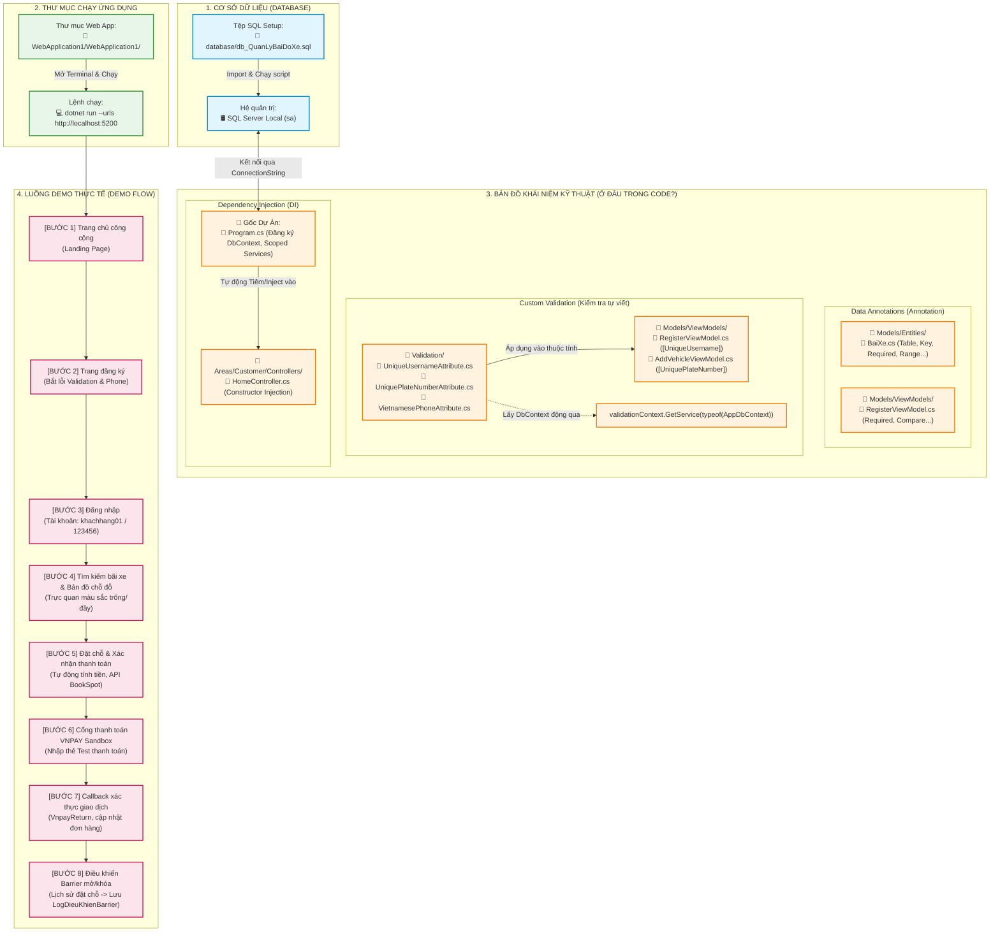

# HƯỚNG DẪN THUYẾT TRÌNH VÀ DEMO DỰ ÁN SMARTPARKING (PHÂN HỆ PUBLIC & CUSTOMER)

Tài liệu này hướng dẫn bạn cách chạy dự án, dẫn dắt bài thuyết trình thực tế (vừa chạy demo vừa giới thiệu tính năng) và cách giải thích mã nguồn chi tiết về các khía cạnh kỹ thuật theo yêu cầu: **Annotation (Chú thích dữ liệu)**, **Custom Validate (Kiểm tra tùy chỉnh)** và **Dependency Injection (Tiêm phụ thuộc)**.

---

## SƠ ĐỒ HỆ THỐNG VÀ BẢN ĐỒ KHÁI NIỆM KỸ THUẬT



---

## PHẦN 1: HƯỚNG DẪN CHẠY DỰ ÁN (RUN PROJECT)

1. **Khởi động SQL Server:** Đảm bảo dịch vụ SQL Server Local hoặc Docker đang chạy và database `QuanLyBaiXe` đã được import từ tệp `database/db_QuanLyBaiDoXe.sql`.
2. **Chạy ứng dụng:**
   * Mở terminal tại thư mục dự án: `d:\HK225\CSHARP\CUOIKICSHARP\WebApplication1\WebApplication1`
   * Chạy lệnh: `dotnet run --urls http://localhost:5200`
3. **Mở trình duyệt:** Truy cập địa chỉ `http://localhost:5200` để bắt đầu buổi trình diễn.

---

## PHẦN 2: KỊCH BẢN DEMO VÀ THUYẾT TRÌNH TỪNG BƯỚC (PUBLIC & CUSTOMER FLOW)

### Bước 1: Giới thiệu Trang chủ (Public) & Đăng ký tài khoản mới
* **Thao tác trên Web:**
  * Giới thiệu giao diện landing page hiện đại của SmartParking (màu sắc hài hòa, responsive, giới thiệu các tính năng bãi xe đỗ thông minh).
  * Nhấn vào nút **Đăng ký** để chuyển sang trang tạo tài khoản.
  * Nhập sai định dạng số điện thoại (ví dụ: `12345` hoặc chữ cái) hoặc nhập tên đăng nhập trùng với tên đã có (`khachhang01`) để biểu diễn tính năng bắt lỗi trực tiếp tại giao diện.
* **Cách thuyết trình phần Code liên quan:**
  * **Mở file:** `Models/ViewModels/RegisterViewModel.cs`
  * **Giải thích:** 
    * "Để kiểm tra dữ liệu đầu vào của người dùng ngay từ tầng Model trước khi chuyển vào Controller, chúng em sử dụng **Data Annotations (Annotation)** như `[Required]` (bắt buộc nhập), `[StringLength]` (giới hạn ký tự), `[EmailAddress]` (kiểm tra email)."
    * "Đặc biệt, để kiểm tra các điều kiện nghiệp vụ thực tế như số điện thoại Việt Nam hợp lệ hay tên đăng nhập không được trùng lặp, chúng em đã viết các **Custom Validation Attributes**."
    * **Chỉ vào code:** 
      * `[UniqueUsername]` để chặn đăng ký tài khoản trùng tên.
      * `[VietnamesePhone]` để bắt người dùng nhập đúng định dạng số điện thoại Việt Nam (10-11 chữ số, bắt đầu bằng 03, 05, 07, 08, 09...).

---

### Bước 2: Đăng nhập hệ thống
* **Thao tác trên Web:**
  * Đăng nhập tài khoản khách hàng demo đã chuẩn bị sẵn trong Seed Data:
    * **Tên đăng nhập:** `khachhang01`
    * **Mật khẩu:** `123456`
  * Sau khi đăng nhập, hệ thống sẽ chuyển hướng khách hàng vào khu vực Dashboard dành riêng cho Khách hàng (`/Customer/Home`).

---

### Bước 3: Tìm kiếm bãi đỗ & Chọn chỗ đỗ xe trực quan
* **Thao tác trên Web:**
  * Nhập bộ lọc tìm kiếm: Chọn thành phố, quận huyện, xã phường hoặc gõ tên bãi đỗ (Ví dụ: Tìm kiếm khu vực **Gia Lai**).
  * Nhấp vào bãi xe **Bãi Xe Thông Minh Quang Trung**.
  * Hệ thống sẽ hiển thị bản đồ chỗ đỗ dạng lưới (Grid) cực kỳ trực quan:
    * Màu xanh lá: Chỗ trống có thể đặt.
    * Màu đỏ: Chỗ đang có xe đỗ.
    * Màu vàng: Chỗ đã được người khác đặt trước.
    * Màu xám: Chỗ đang bảo trì thiết bị.
  * Chọn thời gian đỗ xe (Thời gian bắt đầu, thời gian kết thúc) và chọn loại hình thuê (Theo giờ, qua đêm, theo tháng).
  * Click vào một ô màu xanh lá (Ví dụ: `A-02` hoặc `A-04`).
  * Nhập biển số xe đã đăng ký của khách hàng (`81A-12345`).
  * Giao diện sẽ tự động tính toán tổng chi phí tiền cọc dựa theo bảng giá cấu hình của bãi xe đó cho loại xe tương ứng.

---

### Bước 4: Đặt chỗ & Thanh toán qua VNPAY Sandbox
* **Thao tác trên Web:**
  * Nhấn nút **Xác nhận thanh toán**.
  * Hệ thống hiển thị hộp thoại thông báo khởi tạo đơn đặt chỗ thành công và tự động chuyển hướng khách hàng sang trang cổng thanh toán thử nghiệm **VNPAY Sandbox**.
  * *Mô phỏng thanh toán:* Nhập thông tin thẻ test VNPAY (Ngân hàng NCB, số thẻ `9704198526191432185`, tên chủ thẻ `NGUYEN VAN A`, OTP: `123456`) để hoàn tất thanh toán.
  * Cổng VNPAY sẽ chuyển hướng khách hàng quay trở lại trang web của ta (`/Customer/Home/VnpayReturn`).
  * Trang Web kiểm tra chữ ký bảo mật bảo vệ giao dịch, cập nhật trạng thái đơn đặt chỗ từ `"Chờ thanh toán"` thành `"Đã đặt"` và hiển thị thông báo thanh toán thành công.
* **Cách thuyết trình phần Code liên quan:**
  * **Mở file:** `Areas/Customer/Controllers/HomeController.cs` (Phương thức `BookSpot` và `VnpayReturn`).
  * **Giải thích:** 
    * "Phương thức `BookSpot` nhận thông tin đặt lịch, kiểm tra xem có bị trùng lịch đỗ xe ở vị trí đó hay không. Nếu hợp lệ, hệ thống sẽ thực hiện giao dịch ghi nhận đơn đặt chỗ (`DatCho`), hóa đơn (`HoaDon`), thanh toán (`ThanhToan`) dưới trạng thái chờ thanh toán."
    * "Sau đó, phương thức sử dụng thư viện `VnPayLibrary` để mã hóa chữ ký HMAC-SHA512 bảo mật và tạo ra đường dẫn chuyển hướng sang cổng thanh toán VNPAY."
    * "Khi người dùng thanh toán xong, VNPAY gửi phản hồi về phương thức `VnpayReturn`. Tại đây, hệ thống xác thực chữ ký bảo mật trả về từ VNPAY để ngăn ngừa giả mạo giao dịch, cập nhật trạng thái hóa đơn là đã thanh toán thành công và mở khóa thiết bị."

---

### Bước 5: Điều khiển Barrier thông minh (IoT Device Control)
* **Thao tác trên Web:**
  * Vào menu **Lịch sử đặt chỗ** (hoặc ngay trên màn hình Dashboard).
  * Khách hàng sẽ thấy thẻ thông tin đơn đặt chỗ vừa tạo có nút **Mở khóa** và **Khóa lại**.
  * Nhấp vào nút **Mở khóa** (Open Barrier). Hệ thống sẽ chuyển trạng thái khóa của ô đỗ xe vật lý sang `"Mở"` để khách hàng cho xe vào đỗ. Hệ thống đồng thời chuyển trạng thái đơn đặt từ `"Đã đặt"` sang `"Đang đỗ"`.
  * Nhấp vào nút **Khóa lại** khi rời đi. Trạng thái khóa sẽ cập nhật về `"Đóng"`.
  * Mọi lịch sử thao tác này của khách hàng đều được lưu trữ bảo mật vào bảng nhật ký điều khiển.
* **Cách thuyết trình phần Code liên quan:**
  * **Mở file:** `Areas/Customer/Controllers/HomeController.cs` (Phương thức `ControlBarrier`).
  * **Giải thích:** 
    * "Để cho phép khách hàng tự chủ động điều khiển rào chắn tự động tại chỗ đỗ của mình, chúng em cung cấp API `ControlBarrier`. Khi nhận yêu cầu, hệ thống sẽ kiểm tra quyền sở hữu đơn đặt chỗ, gửi lệnh cập nhật trạng thái vật lý của Barrier trong bảng `ChoDauXe` và lưu lịch sử chi tiết vào thực thể `LogDieuKhienBarrier`."

---

## PHẦN 3: GIẢI THÍCH SÂU VỀ CÁC KHÁI NIỆM KỸ THUẬT

### 1. DEPENDENCY INJECTION (DI - TIÊM PHỤ THUỘC)
* **Khái niệm:** Là mô hình thiết kế giúp tách biệt việc khởi tạo đối tượng ra khỏi các lớp sử dụng chúng, giúp mã nguồn lỏng lẻo (loose coupling), dễ bảo trì và viết Unit Test.
* **Cách đăng ký dịch vụ (DI Registration):**
  * Tại tệp `Program.cs`:
    ```csharp
    // Đăng ký Entity Framework DbContext
    builder.Services.AddDbContext<AppDbContext>(options =>
        options.UseSqlServer(builder.Configuration.GetConnectionString("DefaultConnection")));

    // Đăng ký dịch vụ xác thực tài khoản
    builder.Services.AddScoped<IAccountService, AccountService>();
    ```
  * Giải thích cơ chế vòng đời dịch vụ: `AddScoped` nghĩa là đối tượng dịch vụ sẽ được tạo mới một lần cho mỗi request HTTP gửi đến và tự động giải phóng khi kết thúc request.
* **Cách sử dụng dịch vụ (DI Usage):**
  * Trong các Controller (Ví dụ: `HomeController.cs`):
    ```csharp
    private readonly AppDbContext _context;
    private readonly IConfiguration _configuration;

    // Inject trực tiếp qua Constructor
    public HomeController(AppDbContext context, IConfiguration configuration)
    {
        _context = context;
        _configuration = configuration;
    }
    ```
  * Giải thích: "Khi Controller được ASP.NET Core khởi tạo để phục vụ yêu cầu từ người dùng, Service Provider của ASP.NET Core sẽ tự động tiêm (inject) các phiên bản của `AppDbContext` và `IConfiguration` đã được đăng ký trước đó vào constructor."

---

### 2. DATA ANNOTATIONS (ANNOTATION TRÊN MODEL)
* **Khái niệm:** Sử dụng các thẻ khai báo nằm ngay trên thuộc tính của Class để định nghĩa ràng buộc dữ liệu hoặc cấu trúc quan hệ cơ sở dữ liệu.
* **Ví dụ cụ thể:**
  * Mở tệp: `Models/Entities/BaiXe.cs`
  * Giải thích các Annotation thường dùng:
    * `[Table("BaiXe")]`: Ánh xạ class này trực tiếp thành bảng `BaiXe` trong SQL Server.
    * `[Key]`: Chỉ định đây là thuộc tính khóa chính của bảng.
    * `[DatabaseGenerated(DatabaseGeneratedOption.Identity)]`: Cấu hình cột tự động tăng (Identity) trong database.
    * `[Required(ErrorMessage = "...") ]`: Ràng buộc không được phép Null. Nếu dữ liệu gửi lên bị thiếu, thuộc tính `ModelState.IsValid` của MVC sẽ tự động trả về `false` cùng thông báo lỗi tương ứng.
    * `[Column(TypeName = "decimal(10,2)")]`: Khai báo kiểu dữ liệu thập phân chính xác cao trong SQL Server cho trường `DienTich`.
    * `[ForeignKey("IDChuBai")]`: Xác định mối quan hệ khóa ngoại kết nối trường `IDChuBai` với bảng hồ sơ chủ bãi xe.

---

### 3. CUSTOM VALIDATE (KIỂM TRA TỰ VIẾT TÙY CHỈNH)
* **Khái niệm:** Khi các ràng buộc mặc định của C# (như kiểm tra rỗng, kiểm tra định dạng email) không đủ đáp ứng nghiệp vụ đặc thù, ta tự tạo lớp kiểm tra kế thừa từ `ValidationAttribute`.
* **Ví dụ 1: Kiểm tra Biển số xe không được trùng lặp (`UniquePlateNumberAttribute`)**
  * Mở tệp: `Validation/UniquePlateNumberAttribute.cs`
  * Giải thích cách hoạt động:
    * Class kế thừa từ lớp cha `ValidationAttribute`.
    * Ta override (ghi đè) phương thức `IsValid(object? value, ValidationContext validationContext)`.
    * **Điểm sáng kỹ thuật (DI động):** Vì các Validation Attribute được tạo ở tầng siêu dữ liệu (Metadata) nên không thể tiêm `DbContext` thông qua constructor. Chúng ta giải quyết bằng cách lấy dịch vụ động qua đối tượng context:
      ```csharp
      var context = (AppDbContext?)validationContext.GetService(typeof(AppDbContext));
      ```
    * Từ `context`, ta dễ dàng truy vấn kiểm tra trùng lặp trong cơ sở dữ liệu:
      ```csharp
      var exists = context.Xes.Any(x => x.BienSoXe == plateNumber);
      if (exists)
      {
          return new ValidationResult("Biển số xe này đã tồn tại trong hệ thống.");
      }
      ```
    * Đính kèm Custom Validator này vào ViewModel của phương tiện tại `Models/ViewModels/AddVehicleViewModel.cs`:
      ```csharp
      [UniquePlateNumber(ErrorMessage = "Biển số xe này đã được đăng ký bởi phương tiện khác.")]
      public string BienSoXe { get; set; } = null!;
      ```

* **Ví dụ 2: Kiểm tra số điện thoại Việt Nam (`VietnamesePhoneAttribute`)**
  * Mở tệp: `Validation/VietnamesePhoneAttribute.cs`
  * Giải thích: Sử dụng Regex (Biểu thức chính quy) khớp với định dạng các đầu số nhà mạng tại Việt Nam, trả về `ValidationResult.Success` nếu hợp lệ và thông báo lỗi nếu không đúng cấu trúc số điện thoại Việt Nam.

---

## PHẦN 4: LỜI KHUYÊN CHO BUỔI BÁO CÁO MƯỢT MÀ
1. **Chạy thử trước:** Hãy chắc chắn đã chạy demo đặt chỗ một lần để các dữ liệu phiên làm việc được lưu đệm, tránh tình trạng mất mạng hoặc lỗi kết nối cổng VNPAY Sandbox lúc báo cáo.
2. **Nói về quy trình trước, code sau:** Luôn bắt đầu từ quy trình nghiệp vụ trên giao diện Web (người dùng nhìn thấy gì), sau đó mở đoạn code xử lý tương ứng để chứng minh sự logic của mã nguồn.
3. **Làm nổi bật các cải tiến:** Nhấn mạnh rằng hệ thống sử dụng kết hợp giữa xác thực Cookie an toàn, kiểm soát thiết bị IoT qua DB state, tích hợp VNPAY Sandbox chính xác, và các lớp bảo vệ kiểm tra lỗi bằng Custom Validation ở tầng sâu.
